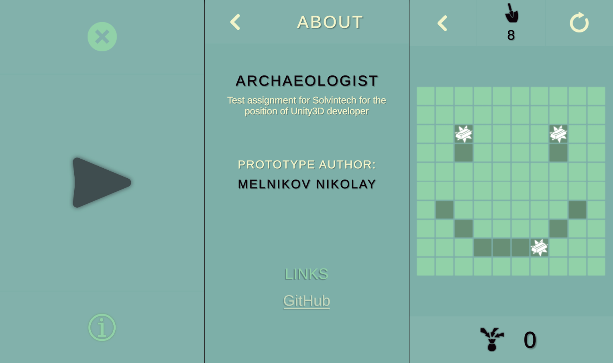

# Archaeologist

Main menu | About menu | Game 
----------------------------------------------------

Язык C#
Среда разработки - любая
Среда выполнения - Unity 2019+

Игра представляет собой поле NxN клеток (для примера 10х10), все клетки имеют определенную максимальную глубину (H - допустим 3).
У игрока есть M лопаток (допустим 20).
Игрок может копать в любой из клеток, тапнув на нее. На каждое такое действие тратится одна лопатка.
Клетку можно раскапывать несколько раз до тех пор, пока игрок не дойдет до максимальной глубины. После этого тапать на нее нельзя.
В каждой клетке с определенной вероятностью появляется “золотой слиток”, который надо поместить в специальную область экрана (мешок) с помощью drag-drop. До тех пор пока лежит награда на клетке, эту клетку копать нельзя.

Игра завершается когда игрок соберет заданное количество наград (K=3)

Надо реализовать:
* Игровую механику и отображение игрового поля
* Сохранение и загрузку состояния игры (автоматически при входе/выходе)
* Рестарт игры по кнопке
* Игровой интерфейс: счетчик лопаток, собранных предметов, область для перетаскивания слитков (мешок)

Не нужно реализовывать:
* красивую графику;
* 3Д игровое поле;
* спецэффекты.

На что будет обращаться внимание:
Архитектура классов, взаимодействие между объектами, чистота кода.
